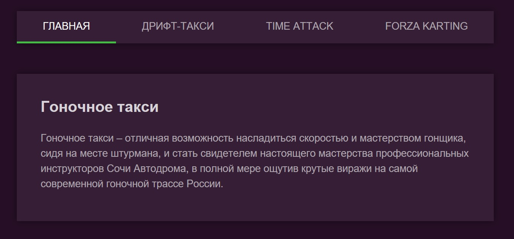

# 15.09_dz
ДЗ к занятию «React Router»

===
 Общий README.md
React Router
===

Необходимо выполнить и предоставить на проверку следующие задачи:

1. [Меню](menu).
2. [CRUD](crud).
3. [authentication](authentication) — необязательная задача.

Все три задачи лучше сдавать в разных репозиториях, то есть через create-react-app реализовать три проекта, чтобы не
было конфликта стилей. Но если вы позаботитесь о том, что конфликта не будет, то можете сдавать и в одном проекте.

#### Альтернативный способ создания приложения React с использованием тулинга Vite

Приложение также можно создать используя инструмент Vite.
Документация по созданию приложения [React](https://vitejs.dev/guide/).

1. Откройте терминал и пропишите следующую команду: `yarn create vite my-app --template react`,
   либо `yarn create vite my-app --template react-ts`, если
   нужен шаблон с TypeScript. Эта команда создаст настроенный
   шаблонный проект.
2. Откройте созданный проект в своей IDE.
3. Установите зависимости.
4. Готово. Чтобы запустить приложение, введите команду: `yarn dev`(либо `npm run dev`).


================================
1-ое Задание: Навигационное меню
===

Необходимо реализовать меню для сайта гоночного такси с пунктами «Главная», «Дрифт-такси», «Time Attack» и «Forza Karting». При переходе на страницу соответствующий пункт меню должен подсветиться:  



## Описание компонента

Компонент должен создавать HTML-разметку вида:
```html
<nav class="menu">
  <a class="menu__item" href="/">Главная</a>
  <a class="menu__item" href="/drift">Дрифт-такси</a>
  <a class="menu__item" href="/timeattack">Time Attack</a>
  <a class="menu__item" href="/forza">Forza Karting</a>
</nav>
```
Активный пункт меню помечается классом `menu__item-active`.

## Реализация

Необходимо реализовать компонент `Menu`.

Воспользуйтесь готовым файлом `App.js` и стилями `css/index.css` из каталога в качестве отправной точки. Замените ими те, что создаются в create-react-app.

**Обратите внимание**: в файлах `App.js` расположено несколько компонентов не потому, что так нужно делать, а чтобы вам было удобнее копировать. Будет хорошо, если в своём решении вы разнесёте их по разным файлам.

Пример:
https://blog.skillfactory.ru/marshrutizatsiya-v-react-router/


--------------------------------------------------------------------------------------------
# React + Vite

This template provides a minimal setup to get React working in Vite with HMR and some ESLint rules.

Currently, two official plugins are available:

- [@vitejs/plugin-react](https://github.com/vitejs/vite-plugin-react/blob/main/packages/plugin-react) uses [Babel](https://babeljs.io/) (or [oxc](https://oxc.rs) when used in [rolldown-vite](https://vite.dev/guide/rolldown)) for Fast Refresh
- [@vitejs/plugin-react-swc](https://github.com/vitejs/vite-plugin-react/blob/main/packages/plugin-react-swc) uses [SWC](https://swc.rs/) for Fast Refresh

## React Compiler

The React Compiler is not enabled on this template because of its impact on dev & build performances. To add it, see [this documentation](https://react.dev/learn/react-compiler/installation).

## Expanding the ESLint configuration

If you are developing a production application, we recommend using TypeScript with type-aware lint rules enabled. Check out the [TS template](https://github.com/vitejs/vite/tree/main/packages/create-vite/template-react-ts) for information on how to integrate TypeScript and [`typescript-eslint`](https://typescript-eslint.io) in your project.
